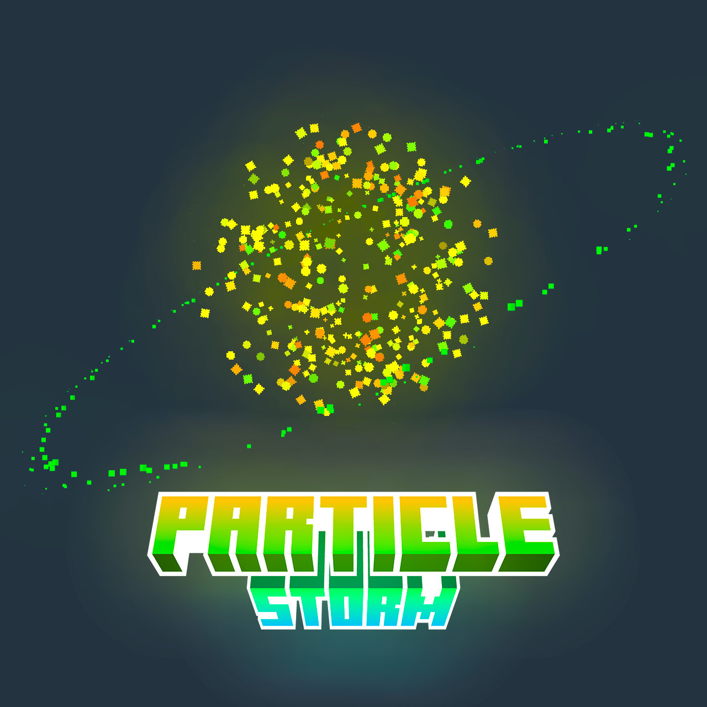

# Particle Storm

Particle effects are one of the unsung heroes of Minecraft. From smoke effects to magic spells, from falling leaves to bubbles coming out of a fish's mouth... all of these effects are possible thanks to the magic of particles.

Particle Storm refactores most of the particle functions of Bedrock Edition. Now you can easily create particle effects by resource pack.

You can check details at [here](https://learn.microsoft.com/zh-cn/minecraft/creator/reference/content/particlesreference/?view=minecraft-bedrock-stable), or create your particles at [here](https://snowstorm.app/).

Also notes that there are some difference between Bedrock Edition and Java Edition, so you should check them at [Wiki](https://github.com/westernat/ParticleStorm/wiki).